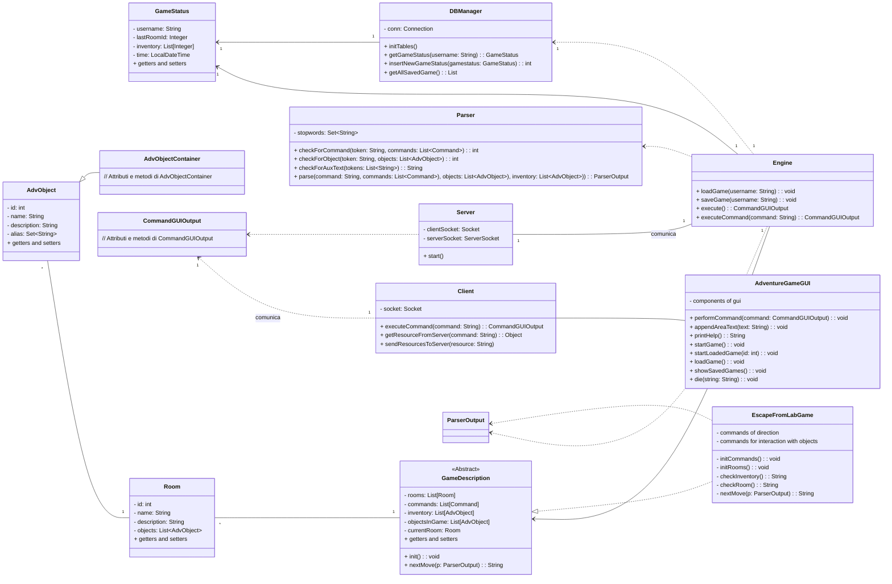

# Avventura testuale "Escape From Lab"

## Descrizione del caso di studio

Il caso di studio consiste in un'applicazione Java che simula un'avventura testuale all'interno di un misterioso laboratorio creata da Dario Ranieri, Julian Pajo e Emanuele Romito nell’ambito del corso di Metodi Avanzati di Programmazione tenuto dal prof. Pierpaolo Basile.

L'obiettivo del giocatore è quello di scappare dal laboratorio risolvendo enigmi, collezionando oggetti utili e interagendo con l'ambiente circostante.

Il laboratorio è ricco di stanze intriganti, ciascuna con la propria descrizione e caratteristiche uniche. Il giocatore dovrà esplorare attentamente ogni stanza, raccogliere oggetti utili e svelare segreti nascosti. Gli oggetti raccolti potrebbero essere fondamentali per risolvere enigmi o superare ostacoli lungo il percorso di fuga.

Per progredire nel gioco, il giocatore dovrà utilizzare il proprio ingegno e la capacità di analizzare gli indizi presenti nelle descrizioni delle stanze e degli oggetti. Potrebbero esserci indizi sottili o rompicapi da risolvere per scoprire nuove informazioni o accedere a stanze precedentemente bloccate.

## Stile architetturale scelto
Lo stile architetturale scelto può essere considerato un'implementazione del design pattern Remote Facade. Il Remote Facade è un design pattern strutturale che fornisce un'interfaccia semplificata per l'interazione con un sottosistema complesso, nascondendo i dettagli di implementazione e semplificando l'uso del sistema remoto.

Nel caso dell'architettura descritta, il Server svolge il ruolo di Remote Facade. Esso espone un'interfaccia semplice per i client, consentendo loro di inviare comandi e ricevere risorse di gioco. Il Server gestisce l'elaborazione delle richieste dei client, avvia nuove istanze di gioco e coordina la comunicazione tra il client e l'Engine.

## Diagramma delle classi

Come scelta progettuale abbiamo deciso di non includere nel diagramma UML:
- Metodi Get() e Set()
- Costruttori
- Attributi e metodi ritenuti di rilevanza marginale per ridurre la complessità del diagramma

## Descrizione diagramma delle classi

- Engine: è il cuore del gioco e gestisce l'esecuzione complessiva del gioco. È responsabile di inizializzare e mantenere lo stato del gioco, gestire l'interazione tra le diverse componenti e fornire le funzionalità di base del gioco come il caricamento e il salvataggio dei giochi, l'esecuzione dei comandi e la gestione dell'output. L'Engine comunica con altre componenti come il Parser, la GameDescription e il DBManager per ottenere le informazioni necessarie e controllare il flusso del gioco.

- GameDescription: La classe GameDescription rappresenta la descrizione completa del gioco, inclusi i dettagli sulle stanze, i comandi disponibili, l'inventario e gli oggetti nel gioco. È una classe astratta che può essere estesa per creare giochi specifici, nel nostro caso EscapeFromLabGame. La GameDescription viene inizializzata dall'Engine all'avvio del gioco e fornisce metodi per gestire le azioni dei giocatori, come la gestione delle mosse e la gestione delle interazioni con l'ambiente di gioco.

- Client e Server: Il Client e il Server gestiscono la comunicazione tra il gioco e gli utenti in un ambiente di rete locale. Il Client è responsabile di inviare i comandi al Server e di ricevere le risorse necessarie per l'esecuzione del gioco. Il Server gestisce le richieste dei client, avvia nuove istanze di gioco e coordina la comunicazione tra i client e il motore di gioco.

- AdventureGameGUI: L'AdventureGameGUI è responsabile dell'interfaccia utente grafica del gioco. Implementata in JSwing, fornisce i componenti grafici necessari per l'interazione con il giocatore, come pulsanti, aree di testo e finestre di dialogo. Comunica con l'Engine per inviare comandi e ricevere output da visualizzare all'utente. È in grado di gestire azioni come l'esecuzione dei comandi, l'aggiornamento dell'output e la gestione degli eventi dell'interfaccia utente.

- DBManager: Il DBManager gestisce la connessione al database e fornisce funzionalità per inizializzare le tabelle necessarie, ottenere lo stato di gioco di un utente, inserire nuovi stati di gioco e recuperare tutti i giochi salvati. Comunica con l'Engine per fornire le informazioni sullo stato di gioco richieste e per memorizzare i nuovi stati di gioco.

- Parser: Il Parser è responsabile di analizzare i comandi inseriti dal giocatore e di interpretarli in un formato comprensibile per l'Engine. Utilizzando algoritmi di parsing e tokenizzazione, il Parser estrae informazioni importanti dai comandi, come i verbi e gli oggetti, e li trasforma in una rappresentazione strutturata per l'esecuzione del gioco. Comunica con l'Engine per fornire l'output del parsing.

- EscapeFromLabGame: Implementa la logica del gioco "EscapeFromLab", con metodi per inizializzare i comandi, le stanze e gestire le azioni dei giocatori come spostarsi, interagire con gli oggetti, controllare l'inventario e la stanza corrente.

- Room: Rappresenta una stanza nel gioco, con attributi come ID, nome, descrizione e una lista di oggetti presenti nella stanza. Fornisce anche metodi per accedere agli attributi.

- AdvObject: Rappresenta un oggetto nel gioco, con attributi come ID, nome, descrizione e alias. Fornisce anche metodi per accedere agli attributi.

- AdvObjectContainer: Rappresenta un contenitore di oggetti nel gioco. Non sono specificati attributi o metodi nel diagramma.

- GameStatus: Rappresenta lo stato di gioco di un utente, includendo informazioni come il nome utente, l'ultimo ID della stanza, l'inventario e il tempo di gioco.

- CommandGUIOutput: Rappresenta l'output di un comando nell'interfaccia utente grafica del gioco. Viene utilizzata per comunicare tra Client e AdventureGameGUI.

## Implementazione argomenti del corso

- Thread: L'architettura del gioco utilizza thread per gestire il timer e la progressione delle radiazioni all'interno del gioco. Un thread è dedicato al timer e viene utilizzato per aggiornare la JProgressBar della GUI, che rappresenta visivamente il livello delle radiazioni. Allo stesso tempo, il client utilizza un altro thread che rimane in ascolto per rilevare l'incremento del Timer e agire di conseguenza. Questa struttura permette di gestire in modo efficiente il timer e la progressione delle radiazioni nel gioco, fornendo un'esperienza di gioco fluida e reattiva.

- JBDC: Nell'architettura del gioco, si è fatto uso di JDBC (Java Database Connectivity) per la gestione dei salvataggi. Questo permette di salvare lo stato di gioco, includendo informazioni come l'ultima stanza visitata, l'inventario del giocatore e il tempo trascorso nel gioco.

- Socket: Nell'architettura del gioco, si è utilizzato il concetto di socket per implementare un'architettura client-server. Nel contesto del gioco, il server e il client si comunicano tra loro utilizzando socket per scambiare dati e comandi.

- File: Nell'architettura del gioco, i file vengono utilizzati per caricare le descrizioni e i titoli delle stanze. Ogni stanza può avere una descrizione testuale che fornisce dettagli sul suo ambiente, insieme a un titolo che ne identifica posizione nel gioco.

- SWING: Nel progetto del gioco, si è utilizzata Java Swing per creare un'interfaccia grafica interattiva e consentire all'utente di interagire con il gioco. Sono state create diverse finestre e componenti grafici per visualizzare le informazioni di gioco e fornire mezzi per l'input dell'utente.

- lambda expression: Le lambda expression si sono utilizzate per ottenere una sintassi concisa. Ci ha permesso di scrivere funzioni anonime in modo più conciso rispetto all'utilizzo delle classi interne o delle classi anonime per rendere il codice più leggibile e per ridurre la quantità di codice di supporto necessario.

## Manuale Utente

### Introduzione
Ti trovi all'interno di un laboratorio scientifico avanzato, ma purtroppo, una catastrofe è imminente.
Il laboratorio è stato avvolto da nubi radioattive che si stanno espandendo rapidamente.
Il tuo obiettivo principale è quello di trovare un modo per uscire dal laboratorio il prima possibile e metterti in salvo.

### Istruzioni di Gioco

Il gioco utilizza un sistema di riferimento relativo per la navigazione.
L'ambiente è suddiviso in stanze, ognuna delle quali è collegata ad altre stanze in base alla posizione cardinale.
Ad esempio, se ti sposti ad ovest da una stanza, per tornare indietro dovrai utilizzare il comando "sud", lo stesso
vale se ti sposi a nord, dovrai utilizzare il comando "sud" per tornare indietro.

### Comandi di Navigazione
- `nord` oppure `N` - Ti sposti verso nord nella stanza successiva.
- `sud` oppure `S`- Ti sposti verso sud nella stanza precedente.
- `est` oppure `E`- Ti sposti verso est nella stanza adiacente.
- `ovest` oppure `O` - Ti sposti verso ovest nella stanza adiacente.

### Comandi dell'Inventario
- `inventario` oppure `INV` - Mostra l'inventario degli oggetti che hai raccolto.
- `prendi [nome oggetto]` - Raccoglie un oggetto presente nella stanza e lo aggiunge al tuo inventario.

### Comandi di Interazione con gli Oggetti
- `accendi [nome oggetto]` - Accende un oggetto che può essere acceso, come una luce o un interruttore.
- `spegni [nome oggetto]` - Spegne un oggetto che è stato acceso in precedenza.
- `sblocca [nome oggetto] "[password]"` - Sblocca un oggetto che è stato chiuso o bloccato.
- `apri [nome oggetto]` - Apre un oggetto che può essere aperto, come una cassa.
- `usa [nome oggetto]` - Utilizza un oggetto che può essere utilizzato, come un computer.

### Comandi di Interazione con le Stanze
- `osserva` - Osserva la stanza in cui ti trovi e mostra una descrizione degli oggetti al suo interno.

### Comando di Aiuto
- `help` - Mostra l'elenco dei comandi disponibili.
-
### Comando di Fine Gioco
- `muori` - Termina il gioco.

## Mappa di gioco

## Soluzione del gioco

- (E,E)
- SPEGNI CISTERNA
- (S,S,N)
- PRENDI TORCIA
- (S,O,O)
- ACCENDI TORCIA
- PRENDI CHIAVE
- (S,S,E,O)
- APRI CASSETTA
- PRENDI MARTELLO
- (S,N,N)
- ACCENDI GENERATORE
- (S,S,S,N,O,N,N)
- PRENDI POSTIT
- (E)
- PRENDI BRACCIALE
- (S,O)
- APRI CASSETTO
- PRENDI PEZZO DI CARTA
- (S,N)
- PRENDI PALMARES
- SBLOCCA PALMARES "12311loco11721"
- USA PALMARES
- (S,S,S,S,N,N)
- PRENDI YELLOWKEYCARD
- (S,E,E,N,N,E,N,N)
- PRENDI REDKEYCARD
- (S,S,S,S,S,S,S,O,N,N)
- PRENDI TELECOMANDO
- SBLOCCA TELECOMANDO "3215"
- USA TELECOMANDO
- (S,O)
- APRI SARACINESCA

## Specifica algebrica di _Lista_
### SPECIFICA SINTATTICA
- **sorts** :
  - Object
  - int
  - boolean
  - List&lt;Object&gt;

- **operations** :
  - new() &rarr; List&lt;Object&gt;
  - add(List,Object) &rarr; List
  - add(List, Object, int) &rarr; List
  - indexOf(List,Object) &rarr; Object
  - size(List) &rarr; int
  - isEmpty(List) &rarr; boolean
  - clear(List) &rarr; List
  - contains(List,Object) &rarr; boolean
  - remove(List,Object) &rarr; List
  - removeElement(List,int) &rarr; List

### SPECIFICA SEMANTICA
**declare**:
- l : List&lt;Object&gt;
- i : int
- {true, false} : boolean
- obj : Object

